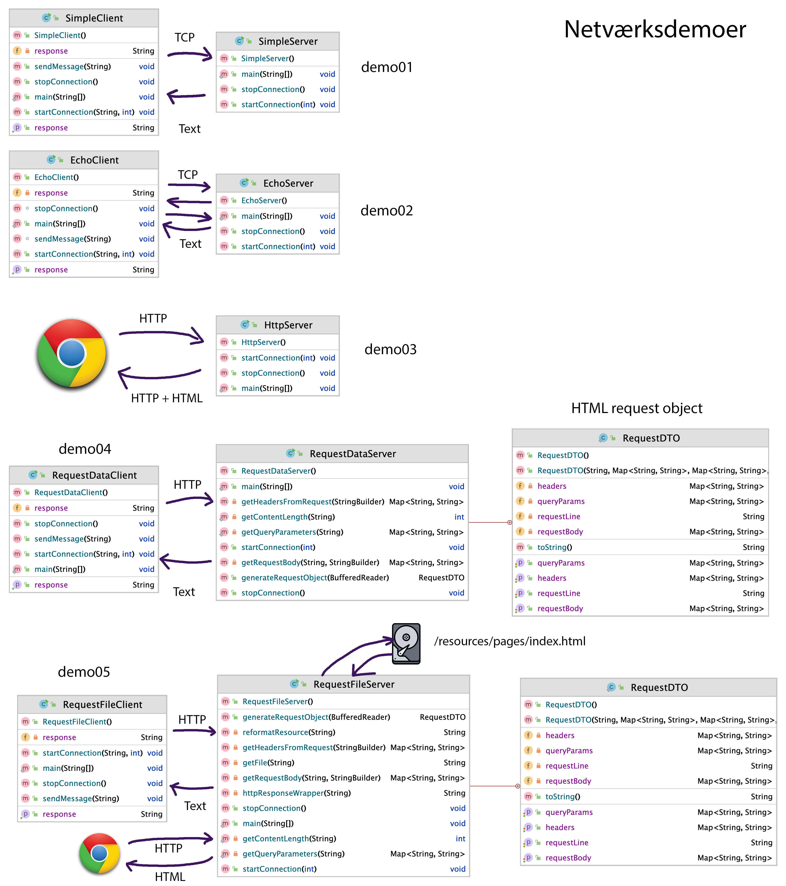

# Netværksdemoer på 2. semester

Følgende kodeeksempler skal anvendes i forbindelse med netværksugen på 2. semester.

Der er en stigende progression i eksemplerne. Her er en oversigt over de enkelte demoer
og hvad deres formål er.

De fleste eksempler kan køres på to måder:

### Gennem main

1) Start først serverens main method
2) Start dernæst klientens main metode og hold godt øje med output

### Unit-tests

1) Find den tilhørende unit-test og kør den. Bemærk at serveren startes i sin egen tråd for at det kan lade sig gøre. Mere om det i næste uge.

## Demo 01 - SimpleClient og SimpleServer

Klienten sender en enkelt tekstlinie til serveren og modtager en tekstlinie med svar. 
Ren TCP/IP udveksling. Både klient og server lukkes ned efter transaktionen.

## Demo 02 - EchoClient og EchoServer

Klienten sender tre linier tekst til serveren, som serveren sender retur (ekko'er). Bemærk at 
serveren ikke lukkes ned før den modtager beskeden "bye". Også her laves alt med ren TCP/IP.

## Demo 03 - HttpServer

Klienten sender en HTTP header afsted som flere linier tekst til serveren. Serveren kvitterer ved at 
sende et ægte HTTP response tilbage. Det gør det muligt at lave et klient request fra en browser, der viser
den stump html som sendes tilbage i responset. Bemærk at vi nu kører efter HTTP protokollen over TCP/IP. Tænk over
hvad det egentlig betyder. Vi har nu taget det første spæde spadestik mod at få lavet en webserver, der kan 
vise html-sider. Vi mangler selvfølgelig en hel de ting for at det kan fungere i praksis. Men der er hul
igennem, og vi har set hvordan man får en HTTP header igennem en socket.

## Demo 04 - RequestClient og RequestServer

I demo 03 fortolkede vi ikke indholdet af HTTP requestet. Dvs, at vi ikke læste indholdet, så vi kunne bruge det
til noget. Det gøres i denne demo. Det kaldes at **parse** indholdet af headeren. 

## Demo 05 - RequestDataClient og RequestDataServer

Demo to show how to use sockets to create a simple web server and client in Java.
Run the unit tests to see how the server and client works.
- Demos:
  - Demo1 shows how to create a simple server that can answer a request from a client.
  - Demo2 shows how to create a server that can handle multiple client requests, while keeping the connection open.
  - Demo3 shows how to get the data (request line, headers, query parameters and request body) from the request.
  - Demo4 shows how to create a web server that can serve html files. (requires java 11)

